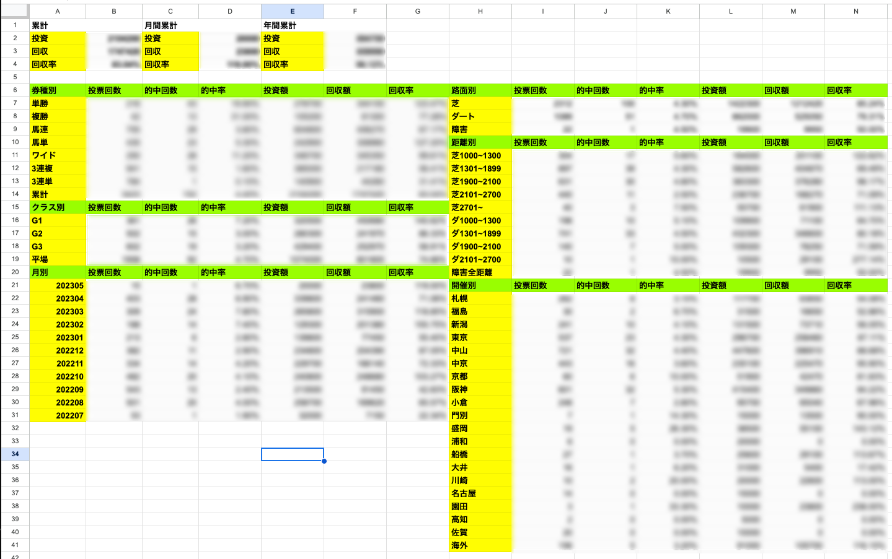
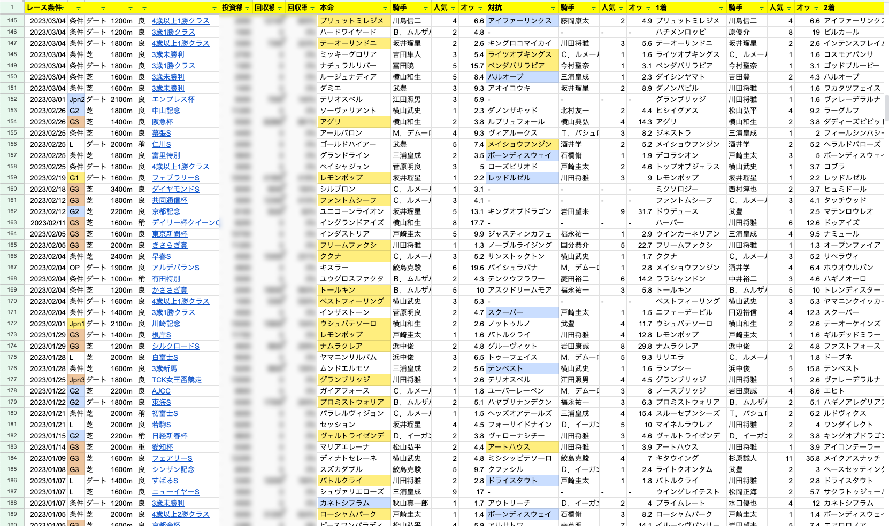

# 馬券集計

## 使い方
1. PATのページから購入結果CSVファイルを取得して`csv`に置く
2. Google SpreadSheetを新規作成する
3. SpreadSheetに権限を与えたときに取得できるjsonファイルを`secret/secret.json`として保存する
4. `secret/spreadsheet.json`を新規作成し、以下の値を設定する
```
{
  "spreadsheet_id": "xxxxxxxxxxxxxxxxxxxxxxxx", // SpreadSheetのURLに書いてあるID
  "spreadsheet_sheet_name": "シート名" // 書き出したいシート名
}
```
5. go mod tidy
6. go run cmd/main.go

## 機能
### 回収率の算出

#### 回収率の集計

期間別、券種別、クラス別、月別、コース種別、距離別、開催場所別ごとに回収率を集計

#### レース結果および購入、払戻結果の集計
  
購入レース単位の購入、払戻、回収率の集計およびレース結果の自動収集